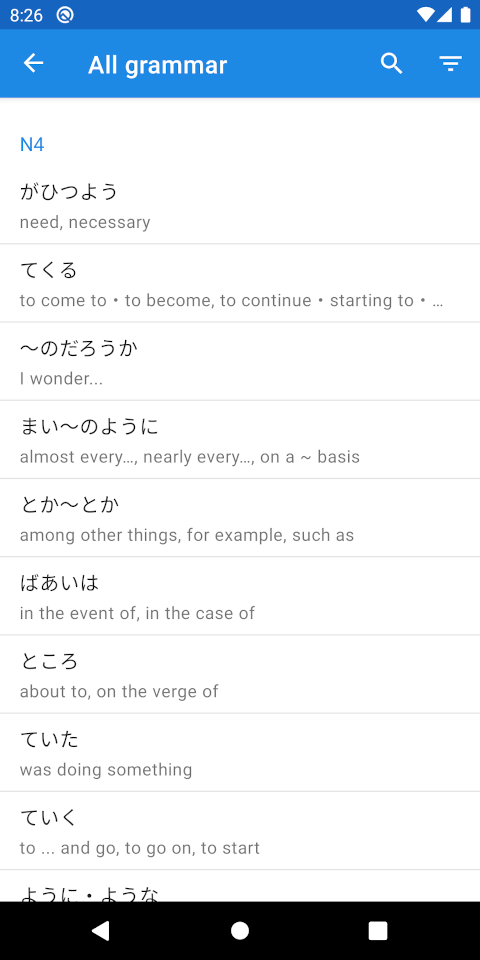
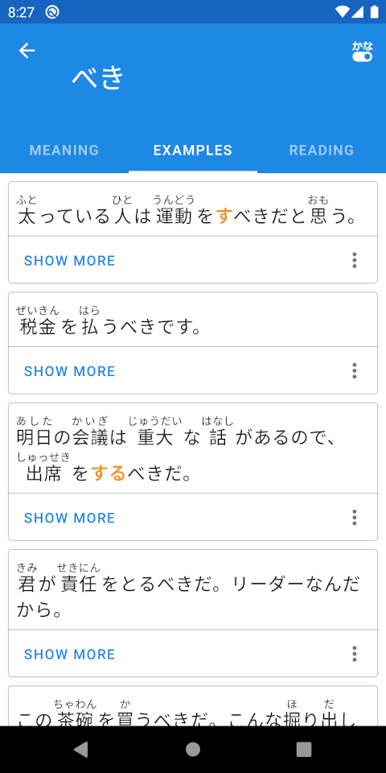

BUNPYRO
=======

Android application for [BunPro](https://bunpro.jp).

Screenshots
-----------

Contribute
----------

Comments and new issues created are welcomed.

External PRs are currently not accepted.

License
-------

BunPyro is currently provided as Source Available Software, but not Open Source Software.

Check [Choose a License - No License](https://choosealicense.com/no-permission/) and
[Wikipedia - Source-available software](https://en.wikipedia.org/wiki/Source-available_software)
for more information.

Copyright 2020 Matthieu Esnault
